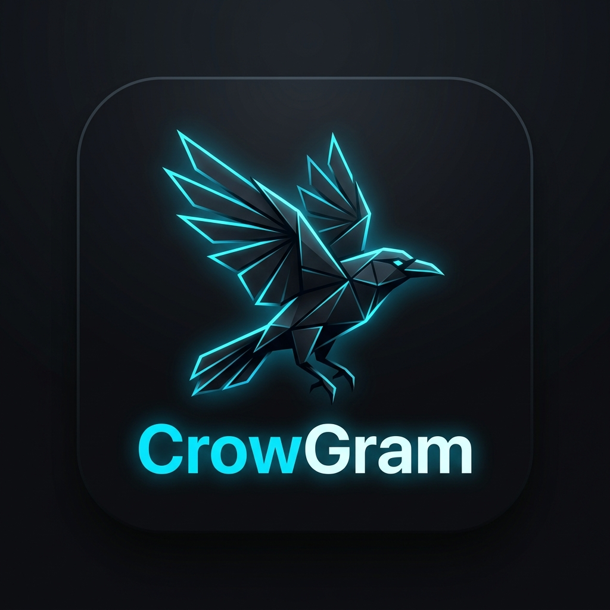

<div align="center">



# CrowGram

### *Бесконечное, приватное и структурированное облачное хранилище на базе Telegram*

[](https://github.com/SlowCrow666/CrowGram/releases/latest)
[](https://www.python.org/)
[](https://github.com/SlowCrow666/CrowGram/releases)
[](LICENSE)

---

[🇬🇧 **English Version**](README.md) • [✨ **Возможности**](#-ключевые-возможности) • [⚡ **Архитектура**](#-почему-crowgram) • [🚀 **Быстрый старт**](#-быстрый-старт) • [🧭 **Мастер настройки**](#-мастер-первого-запуска) • [🔌 **Разработка плагинов**](#-разработка-плагинов-crowapi-sdk)

---

</div>

<br>

## ⚡ Почему CrowGram?

Telegram предоставляет фактически неограниченное облачное хранилище файлов, но в нем отсутствует привычная файловая система: нет виртуальных дисков, древовидных папок, нарезки тяжелых файлов и двухпанельного интерфейса.

**CrowGram решает эту проблему**, превращая ваш аккаунт или закрытые каналы Telegram в быстрое, структурированное облачное хранилище с локальным кэшированием, потоковым воспроизведением и моментальной синхронизацией.

```text
┌────────────────────────────────────────────────────────────────────────┐
│                             Ядро CrowGram                              │
│   [Виртуальные диски] ⇄ [AES Chunk Streamer] ⇄ [Локальная БД SQLite]  │
└───────────────────┬────────────────────────────────┬───────────────────┘
                    │                                │
            ┌───────▼────────┐              ┌────────▼────────┐
            │   Избранное    │              │ Закрытый канал  │
            │(Синхронизация) │              │ (Файлы диска)   │
            └────────────────┘              └─────────────────┘
```

<br>

---

## ✨ Ключевые возможности

<table>
  <tr>
    <td width="50%">
      <h3>🗂️ Виртуальные диски</h3>
      <p>Организуйте файлы по изолированным виртуальным дискам (<code>Диск C:</code>, <code>Диск D:</code> и т.д.), привязанным к Избранному или закрытым Telegram-каналам.</p>
    </td>
    <td width="50%">
      <h3>🧩 Прозрачный параллельный чанкинг</h3>
      <p>Загружайте файлы любого размера (многогигабайтные образы, 4K видео). Файлы автоматически делятся на чанки по 49 МБ и параллельно скачиваются/загружаются.</p>
    </td>
  </tr>
  <tr>
    <td width="50%">
      <h3>🔄 Синхронизация с Telegram в 1 клик</h3>
      <p>Сохраняйте и восстанавливайте полный снимок базы данных метаданных прямо в «Избранное» Telegram. Мгновенно разворачивайте свое облако на любом новом ПК.</p>
    </td>
    <td width="50%">
      <h3>📝 Встроенный редактор кода</h3>
      <p>Полнофункциональный редактор с подсветкой синтаксиса, форматированием JSON и живым просмотром Markdown без дублирования модальных окон.</p>
    </td>
  </tr>
  <tr>
    <td width="50%">
      <h3>⚔️ Двухпанельный CrowCommander</h3>
      <p>Классический двухпанельный менеджер в стиле Total Commander с поддержкой горячих клавиш (<code>F5</code> копирование, <code>F6</code> перемещение, <code>F8</code> удаление).</p>
    </td>
    <td width="50%">
      <h3>🎨 6 киберпанк и ретро тем</h3>
      <p>Мгновенное переключение между темами: Gemini Dark, Yandex Disk Light, Retro Green Terminal, Amber CRT, ZX Spectrum и 8-bit Dendy NES.</p>
    </td>
  </tr>
  <tr>
    <td width="50%">
      <h3>🔐 Поддержка 2FA и маскировка Desktop</h3>
      <p>Полная поддержка облачных 2FA-паролей Telegram. Клиент маскируется под официальный Telegram Desktop (5.4.1 x64), предотвращая спам-блокировки при входе.</p>
    </td>
    <td width="50%">
      <h3>🌐 Полная приватность и автономность</h3>
      <p>Никаких сторонних серверов и аналитики. Все данные шифруются локально и передаются исключительно между вашим ПК и серверами Telegram MTProto.</p>
    </td>
  </tr>
</table>

<br>

---

## 🚀 Быстрый старт

### 📦 Вариант 1: Готовые бинарные сборки (Релиз 1.1)

Скачайте автономное настольное приложение без необходимости устанавливать Python:

| Операционная система | Тип пакета | Прямая ссылка |
| :--- | :--- | :--- |
| 🪟 **Windows 10 / 11** (x64) | Портативный `.zip` | [📥 **Скачать CrowGram-Windows-x64.zip**](https://github.com/SlowCrow666/CrowGram/releases/download/1.1/CrowGram-Windows-x64.zip) |
| 🍏 **macOS** (Intel / Apple Silicon) | Портативный `.tar.gz` | [📥 **Скачать CrowGram-macOS-x64.tar.gz.zip**](https://github.com/SlowCrow666/CrowGram/releases/download/1.1/CrowGram-macOS-x64.tar.gz.zip) |
| 🐧 **Linux** (Ubuntu / Debian / Arch) | Портативный `.tar.gz` | [📥 **Скачать CrowGram-Linux-x64.tar.gz.zip**](https://github.com/SlowCrow666/CrowGram/releases/download/1.1/CrowGram-Linux-x64.tar.gz.zip) |

<br>

### 🛠️ Вариант 2: Запуск из исходного кода

```bash
# 1. Клонируйте репозиторий
git clone https://github.com/SlowCrow666/CrowGram.git
cd CrowGram

# 2. Установите зависимости
pip install -r requirements.txt

# 3. Запустите настольное приложение
python desktop_app.py
```

*Для запуска только веб-сервера:*
```bash
python app.py
# Откройте http://127.0.0.1:8000 в вашем браузере
```

<br>

---

## 🧭 Мастер первого запуска

При первом открытии CrowGram запускается интерактивный **Мастер настройки**:

```
[ Шаг 1: Язык ] ➔ [ Шаг 2: API ключи ] ➔ [ Шаг 3: Авторизация и 2FA ] ➔ [ Шаг 4: Диск / Восстановление ]
```

1. **Выбор языка:** Выберите **Русский** или **English**.
2. **Ключи API:** Введите ваш `api_id` и `api_hash` с портала [my.telegram.org](https://my.telegram.org).
3. **Авторизация:** Введите номер телефона и код подтверждения. При наличии облачного пароля 2FA форма автоматически запросит его.
4. **Создание диска ИЛИ Восстановление:**
   - **Новый пользователь:** Задайте букву и метку первого диска (например, `C: Основной диск`).
   - **Существующий пользователь:** Нажмите **"📥 Восстановить из Telegram"** или выберите файл `.json` для моментального импорта всех дисков и файлов!

<br>

---

## 🔌 Разработка плагинов (CrowAPI SDK)

CrowGram предоставляет глобальный JavaScript SDK (`window.CrowAPI`) для создания кастомных инструментов, просмотрщиков и плагинов.

### Пример плагина:

Сохраните как `plugins/MyCustomTool.js` (или поместите в `src/web/static/plugins/`):

```javascript
window.CrowAPI.registerPlugin({
    id: 'my-custom-tool',
    name: 'Инспектор хранилища',
    version: '1.0.0',
    init: function(api) {
        console.log('✓ Плагин успешно инициализирован');

        // Перехват клика по файлам .log
        api.on('onFileClick', (id, name, ext) => {
            if (ext === 'log') {
                api.ui.createModal({
                    title: `Просмотр журнала: ${name}`,
                    body: `<p>Открытие потока логов для файла ID: ${id}</p>`
                });
                return true; // Перехватить стандартный просмотр
            }
            return false;
        });
    }
});
```

<br>

---

## 📁 Структура проекта

```text
CrowGram/
├── app.py                     # Бэкенд на FastAPI и стриминг файлов
├── desktop_app.py             # Настольный клиент на базе PyWebView
├── src/
│   ├── config.py              # Конфигурация путей и окружения
│   ├── core/
│   │   ├── db.py              # Ядро SQLite и транзакционная синхронизация
│   │   └── telegram_client.py # Клиент MTProto (маскировка под Desktop 5.4.1)
│   └── web/                   # Фронтенд интерфейса
│       ├── index.html         # Разметка HUD и Мастера запуска
│       └── static/
│           ├── css/           # Стили и дизайн-система
│           ├── js/            # Логика клиента, i18n и CrowAPI SDK
│           └── plugins/       # Встроенные плагины
├── plugins/                   # Папка пользовательских плагинов и документация
├── locales/                   # Словари локализации
└── .github/workflows/         # Воркфлоу автоматической мультиплатформенной сборки
```

<br>

---

## 🛡️ Безопасность и конфиденциальность

- 🔒 **Никакой телеметрии:** Приложение не собирает метрики и не отправляет аналитику третьим лицам.
- 📡 **Прямое соединение:** Запросы идут напрямую на официальные сервера Telegram MTProto.
- 🔑 **Локальные ключи:** Токены сессий и база данных хранятся исключительно на вашем локальном диске.

<br>

---

## 📜 Лицензия

Проект распространяется под открытой лицензией **MIT License**. См. файл [`LICENSE`](LICENSE) для подробностей.

<div align="center">

*Разработано с заботой о приватности и цифровой автономии данных.*

**[⭐ Поставить звезду на GitHub](https://github.com/SlowCrow666/CrowGram)** • **[🐛 Сообщить об ошибке](https://github.com/SlowCrow666/CrowGram/issues)**

</div>
